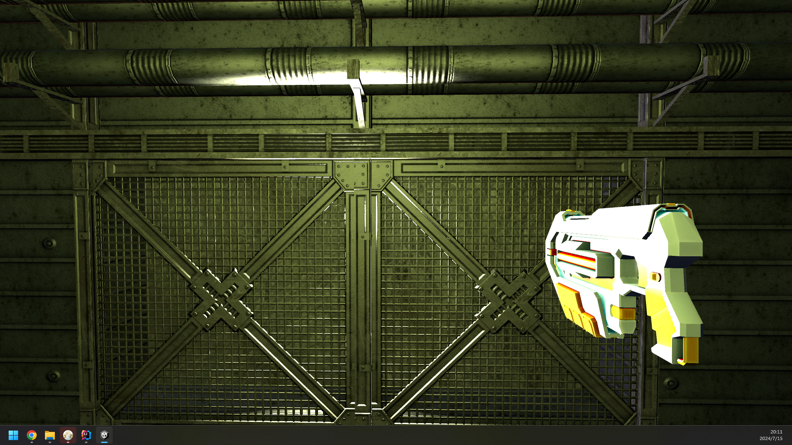
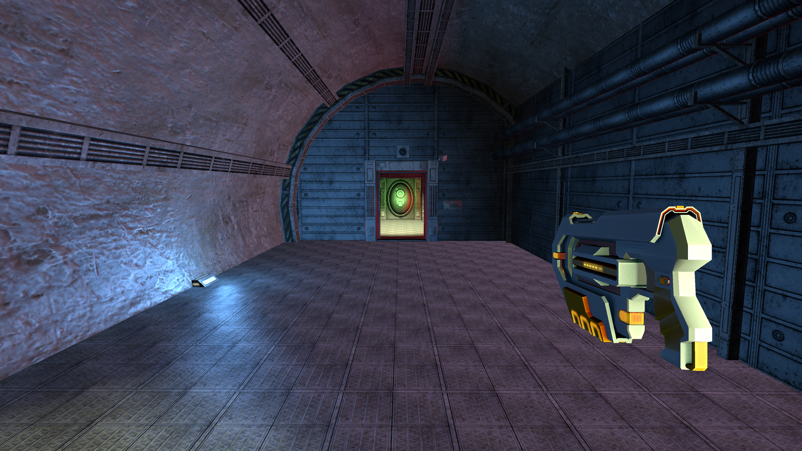
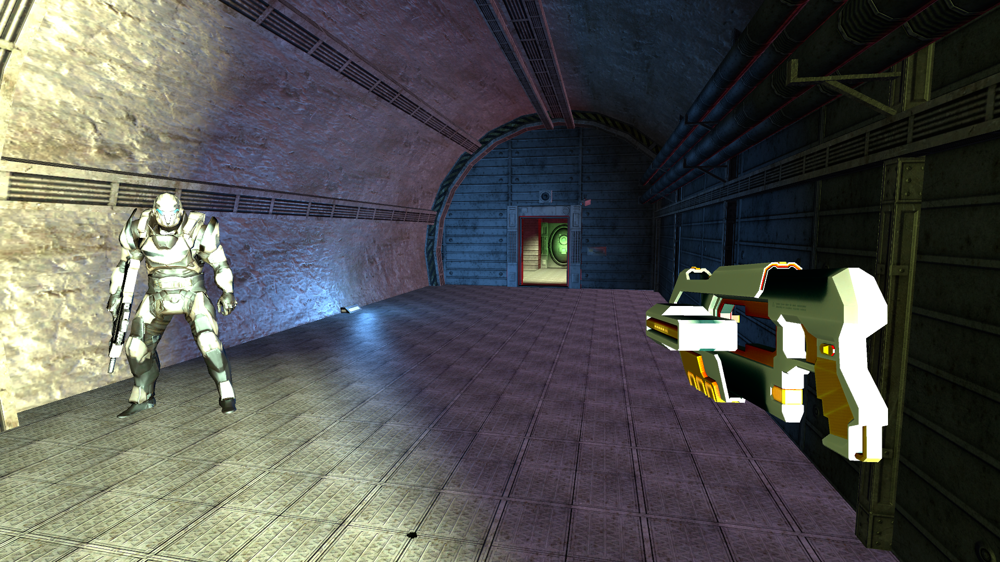
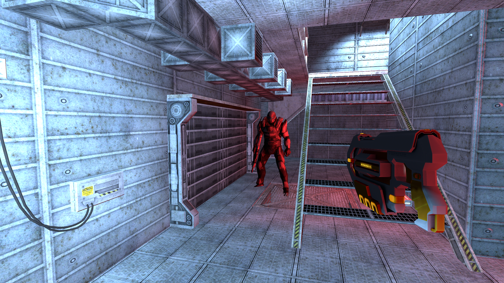
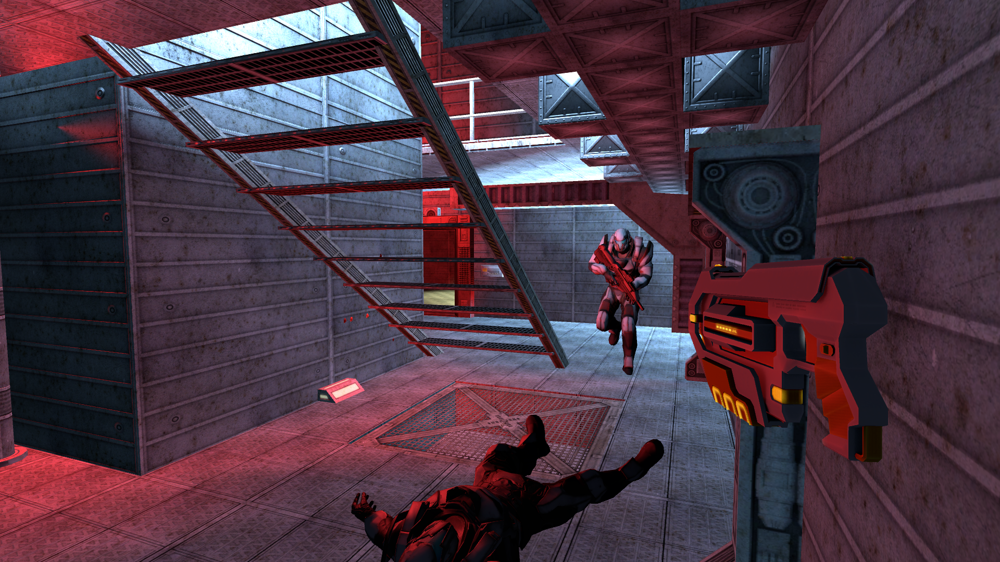
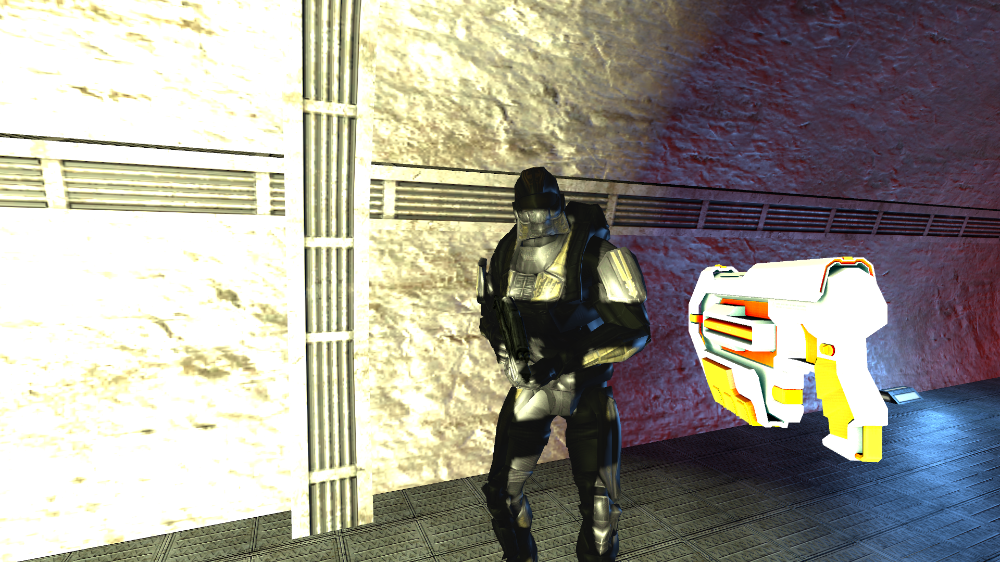
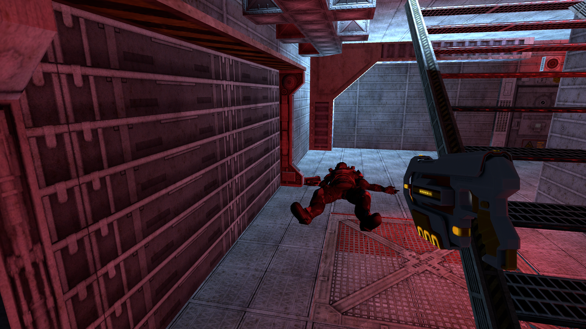
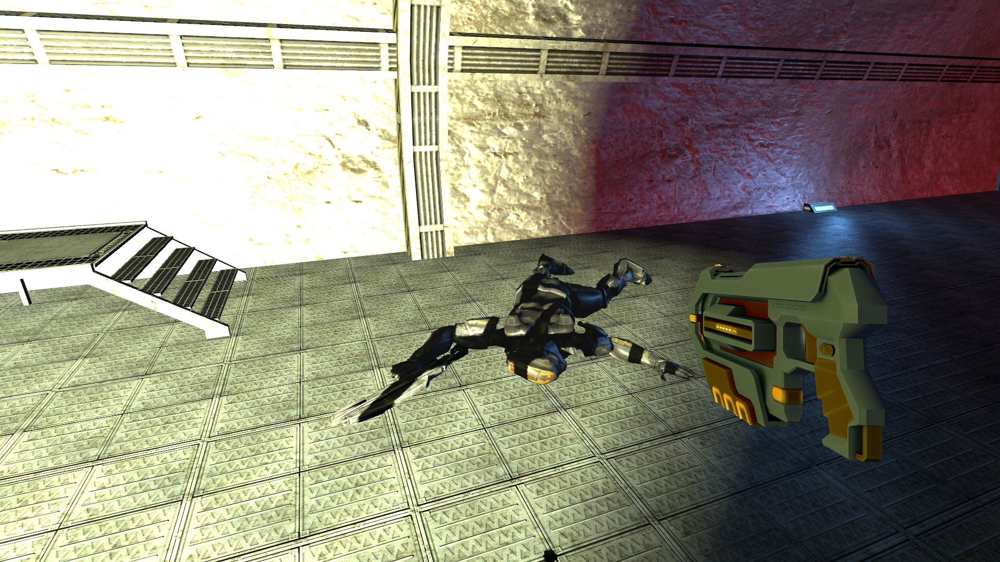

# FPSDemo
 
### 描述
这是在刚接触Unity3D的学习文件，包含了初始阶段的学习代码以及一个FPSDemo实战项目

利用第一人称控制器包进行第一人称视角的控制

为角色提供了武器并设置武器参数,添加了一些动画效果，主要利用射线检测来进行攻击判定，防止子弹速度过快，导致物理阶段无法判断是否触发碰撞效果

创建了敌人生成器，创建出的敌人会根据预先设定的路点进行寻路，当到达目标地点后会从寻路状态转变成攻击状态

当敌人生命值为0时敌人会触发死亡动画并销毁

